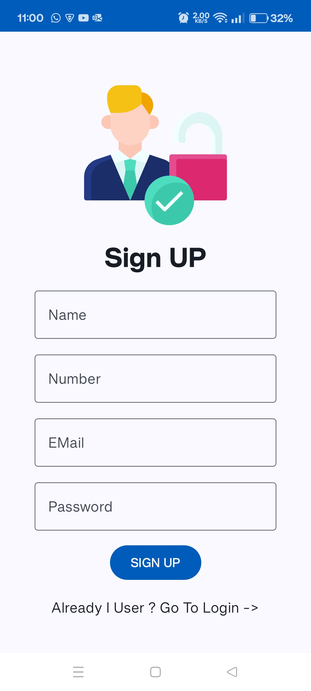
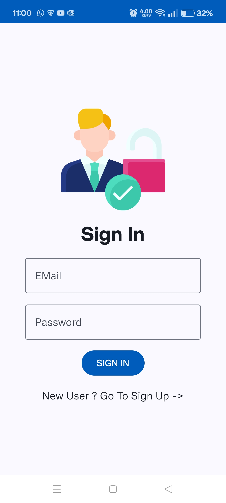
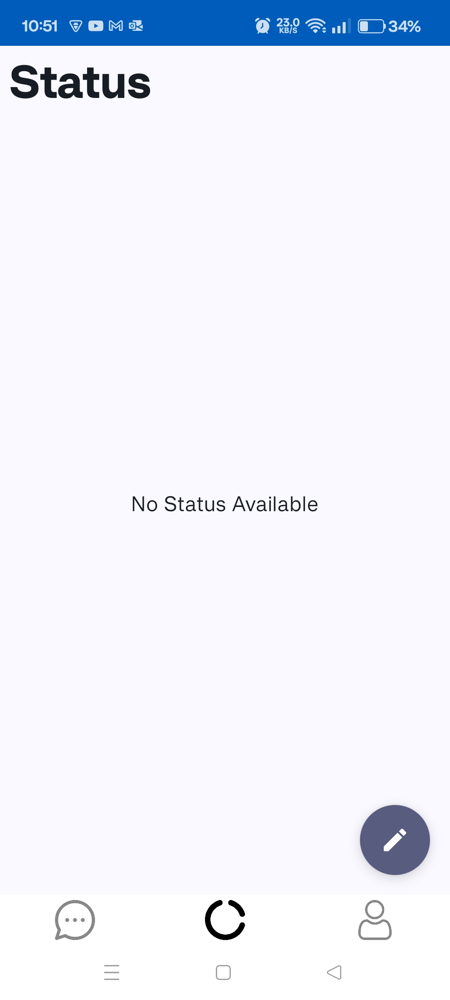
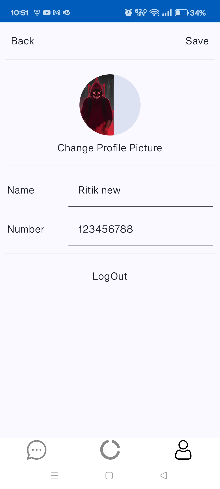
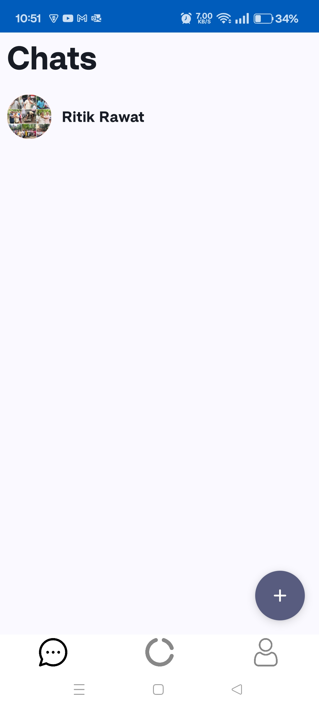

# Live Chat Application

A real-time messaging platform where users can chat instantly, add new contacts, and view status updates just like WhatsApp. Designed for seamless communication, it supports personal and group chats, delivers messages instantly, and keeps you connected with your contacts’ latest activities. The clean and intuitive interface ensures a smooth chatting experience, whether you’re messaging friends, family, or colleagues.

## Table of Contents

- [Getting Started](#getting-started)
  - [Prerequisites](#prerequisites)
  - [Installation](#installation)
- [Technology](#technology)
- [Screenshots](#screenshots)
- [App Preview](#app-preview)
- [Download](#download)

## Getting Started

To get a copy of the project up and running on your local machine, follow these steps:

### Prerequisites

Before getting started, ensure that you have the following:

- [Android Studio](https://developer.android.com/studio) installed on your computer.
- Basic knowledge of Android development.

### Installation 

1. Clone the repository to your local machine using the following command: <br>
```git clone https://github.com/ritikrawat2447/Live-Chat-Application.git```

Alternatively, you can download the repository as a ZIP file and extract it.

2. Open Android Studio and select "Open an existing Android Studio project".

3. Navigate to the directory where you cloned or extracted the repository, and select the project folder.

4. Android Studio will build the project and set up the necessary dependencies. This process may take a few moments.

5. Once the project is successfully built, connect an Android device to your computer or set up an emulator using Android Studio.

6. Click on the "Run" button in Android Studio to deploy the app on your device or emulator.

## Technology
- Kotlin language
- Jetpack Compose
- Android Studio
- FireBase FireStore

## Screenshots

<div style="display: flex;">
  
  
  
  
  
</div>


## App Preview

https://github.com/user-attachments/assets/a97a009e-59fd-44f8-abc1-1ff0bd9c8a00

## Download
To start using the app, you can download the APK file: <a href="https://drive.google.com/file/d/1QzfvHXlcTwbZXIl1yJpXvz2sgFSfpYfE/view?usp=sharing" target="_blank">Download APK</a>
